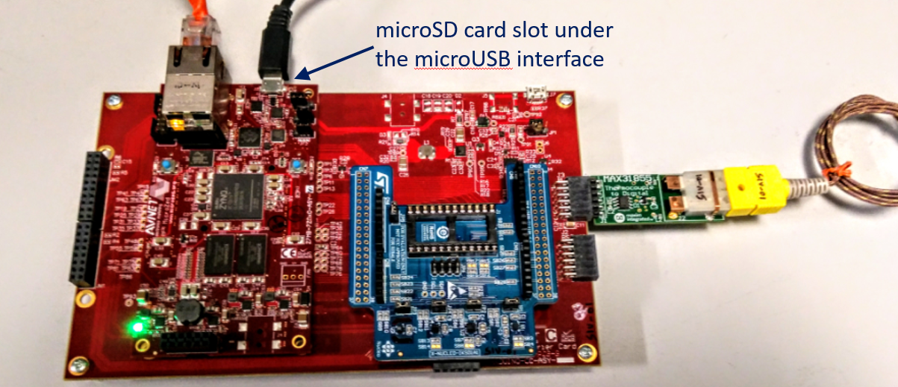
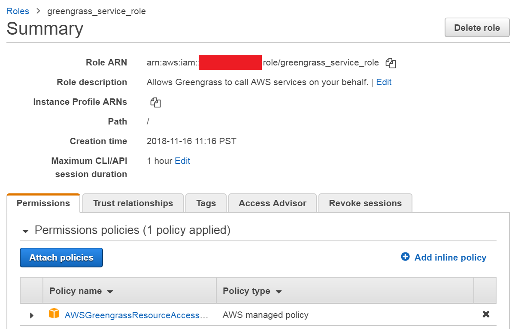

# Lab 1: Setup the Environment

In this lab, you will initialize your account with a static web application, Amazon Cognito, and other configuration.  You will also login to your Amazon Web Services account to configure credentials for the Xilinx hardware used in this workshop.

## Applying your Credits

If part of this workshop you received credits to offset any potential cost occurred in the AWS Cloud during this workshop, please follow these steps to apply the credits.


## Xilinx Hardware Setup

Most of the physical hardware will be pre-configured for you prior to the start of the workshop.  This section outlines the steps to configuring the physical aspects such that you can quickly check your hardware.

### Avnet MicroZed IIoT Kit
1. Attach the ST Micro X-NUCLEO Shield to the Arduno Carrier Card.  This connects the sensor set to the FPGA programmable logic.
2. Plug in the Maxim 31855 PMOD thermocouple to Arduinio Carrier Card J3 connector labeld "PL_PMOD".  Match pin numbers (pin 1 to pin 1) between the boards - plug into the top row of J3.  This connects the sensor to the FPGA programmable logic.
3. Plug the MicroZed System on Module (SoM) onto the Arduno Carrier Card.  When completed with this step the system should look like the picture below.

   
4. Ensure that the microSD card is plugged in. It is located on the bottom side of the board below the USB UART.  Check that the boot mode jumpers (JP1-JP3) are configured for SD Card boot (JP1 - Pins 1 & 2, JP2 - Pins 2 & 3, JP3 - Pins 2 & 3). See picture below for the proper jumper settings.

   
5. Plug an Ethernet cable from the RJ45 connector of the MicroZed SoM to the Ethernet switch on your table.
6. Connect one microUSB cable to J7 of the Arduino Carrier Card and the USB hub.  This provides power to the boards.
7. Connect one microUSB cable to J2 of the MicroZed SoM and the USB hub.  This provides the debug UART interface. Set COM port parameters to 115200,N,8,1.

### Avnet Ultra96

1. Ensure that the microSD is plugged in.
2. Plug in the 12V power supply to J5.
3. Plug in the USB-to-Ethernet adapter to J9, then plug an Ethernet cable between the adapter and the Ethernet switch on your table.
4. Connect a microUSB cable to J1 of the Ultra96 and the USB hub. This provides three services to your PC:
    1. A debug UART interface
    2. A portable drive named 'PYNQ-USB' to navigate the Ultra96 file system
    3. An RNDIS ethernet interface

After the set-up the Ultra96 should look like the picture below.


### Power up your Hardware

The MicroZed should power up automatically when you plug in the microUSB cable. Ensure that D2 (blue LED) and D5 (green LED) on the MicroZed SoM are illuminated.
The Ultra96 should power up after pressing SW3. S3 is the pushbutton switch near the power connector. You should see DS6 and DS9 (green LEDs) illuminated.

### System Software Installation

#### Ultra96 Portable Drive
No installation is required - you should see 'PYNQ-USB' mapped to a drive letter in Windows Explorer. Note the drive letter.

#### Serial Port Installation
The MicroZed and the Ultra96 have one COM port each.
(Windows 7) Open Device Manager to locate your COM ports.  Note the two COM port numbers.

MicroZed uses a Silicon Labs CP2104 USB-to-UART Bridge. If the driver is not automatically detected by your OS, it can be downloaded from: https://www.silabs.com/products/development-tools/software/usb-to-uart-bridge-vcp-drivers.

Ultra96 uses a Gadget Serial Driver. If the driver is not automatically detected by your OS, load the driver from the 'serial_driver' folder on the Ultra96 portable drive.

Ensure you have a serial port terminal emulator such as Putty installed. It can be downloaded from https://www.chiark.greenend.org.uk/~sgtatham/putty/latest.html.

#### RNDIS USB Ethernet Installation
You should see an adapter in Control Panel\Network and Internet\Network Connections labeled 'RNDIS'. If you do not see it, you may need to enable RNDIS on your PC. See https://developer.toradex.com/knowledge-base/how-to-install-microsoft-rndis-driver-for-windows-7

#### Install SFTP on your Laptop
If you have installed Putty, its version of SFTP is called PSFTP. You can use this to transfer files between your laptop and the Ultra96 over the RNDIS adapter.

### Configuring and Deploying your Hardware
Ensure you do not have VPN software running for this workshop.

Configure your terminal emulator to access the two COM ports by saving individual sessions for them. Each session should use 115200,8,N,1 for the serial port settings.

Open the terminal emulator for Ultra96. The username is 'xilinx' and the password is 'xilinx'. Your sudo password is also 'xilinx'.

Run the command `ip a` to see all ethernet interfaces. You should see:
1. usb0 at 192.168.3.1/24
2. eth0 at an address determined by your DHCP server behind the switch
3. Other interfaces will not be used in this workshop

Now run `ping -c 3 www.xilinx.com` to verify internet connectivity.

The Windows RNDIS adapter should be at the address 192.168.3.105/24; ultra96 will be at 192.168.3.1

## AWS Cloud Setup


### Prerequisites

These labs require that you have Git and the AWS Command Line Interface (CLI) installed in order to perform functions to the AWS Cloud. The Ultra96 root file system includes these commands. Perform the following steps in the terminal emulator for the Ultra96.

### Clone Workshop Repository

In this section, you will clone the workshop Git repository.  The Git repository contains all the workshop code and scripts you will use.

1. If not already done, open the UART connection to the Ultra96 device as 115200-8-N-1.
2. Ensure you are in the $HOME directory

   ```bash
   cd $HOME
   ```
3. Clone the repository by running the following command, and set a shell variable for the directory to make navigation simpler.

   ```bash
   git clone https://github.com/rpcme/aws-cloud-and-xilinx-workshop
   export WORKSHOP_HOME=$(pwd)/aws-cloud-and-xilinx-workshop
   cd $WORKSHOP_HOME
   ```
You're done! Let's move to the next section.

### Configure AWS Command Line Interface (CLI)

In this section, we will configure the AWS CLI on the Ultra96 board. 
The AWS CLI has already been installed for you.

Accept the default options presented by hitting ENTER each time.

```bash
aws configure
```

For more information or details on configuration, visit the [Configuring the AWS CLI](https://docs.aws.amazon.com/cli/latest/userguide/cli-chap-getting-started.html) page. This step will ask for the following pieces of information:
1. Your AWS Access Key ID
2. Your AWS Secret Access Key
3. Default region name - use *eu-west-1*
4. Default output format


Note that the first two will be stored unencrypted in the file ~/.aws/credentials, while the remainder will be stored in ~/.aws/config. For your security, delete the credentials file at the end of the workshop.

The following scripts will succeed if your IAM user has the *AdministratorAccess* policy attached with no permission boundaries.
This is very broad, and narrower options might succeed. 

To make sure greengrass runs properly, you also need to associate the 
*AWSGreengrassResourceAccessRolePolicy* to your account:

1. Open up your IAM service and create a role called `greengrass_service_role`.

2. Attach the *AWSGreengrassResourceAccessRolePolicy* to the role. The result looks like the following:

	

3. Copy the 'Role ARN' field.

4. Use the following command in your terminal

    ```bash
    aws greengrass associate-service-role-to-account --role-arn <your-copied-ARN>
    ```
    
   If this is successful, you will see a confirmation from the terminal that the role is associated to the account.


### Deploy AWS Cloud Artifacts

In this section, you will deploy AWS Cloud artifacts to your AWS account by using AWS Cloudformation.

1. Navigate to the directory containing the scripts for deploying cloud objects.

   ```bash
   cd $WORKSHOP_HOME/cloud/script
   ```
2. Run the script that triggers the Cloudformation deployment.  The script packages deployable artifacts such as AWS Lambda functions, copies all the artifacts to an S3 bucket, and then executes the Cloudformation script from that S3 bucket.

	```bash
	./deploy-s3-objects.sh <your_unique_prefix>
	```

The Cloudformation deployment occurs asynchronously, so the script will immediately return with a resulting stack deployment ID. You can use this stack deployment ID to check the status of the deployment. 

The above deployment will prepare an S3 bucket named `<your_unique_prefix>-s3` for you. 
The script will also create a local folder `/home/xilinx/<your_unique_prefix>-s3` for your files to synchronize with the S3 bucket.

Note that S3 bucket names are globally unique. This means that if someone else has a bucket 
of a certain name, you cannot have a bucket with that same name. 
If you see 'BucketAlreadyExists' error, try to rerun the script with another prefix.


### Store your AWS IoT Endpoint address in a text file
To find your endpoint address:
1. Login to the AWS IoT console for the Region that you entered above when you ran 'aws configure'.
2. Click on *Settings*
3. Ensure your *Custom endpoint* is *Enabled*
4. Copy to the clipboard the contents of the *EndPoint* box in the *Custom endpoint* section
5. Create and open a text file on your laptop in *C:\temp* called *node-zynq7k.broker.txt*. 
6. Paste your clipboard into this file and save it


## Outcomes
In this lab, you installed prerequisites to your workstation and installed lab prerequisites to the AWS Cloud in your account.

# Learning More About These Concepts


[Next Lab](./Lab2.md)

[Index](./README.md)
