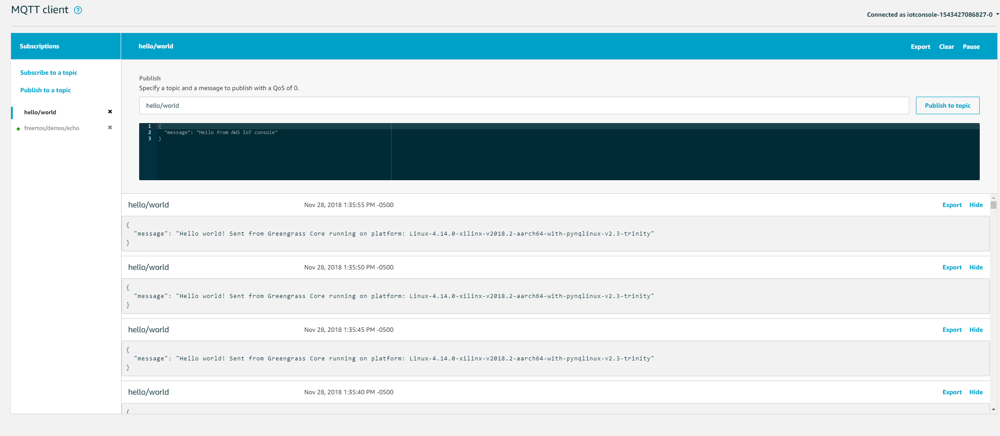
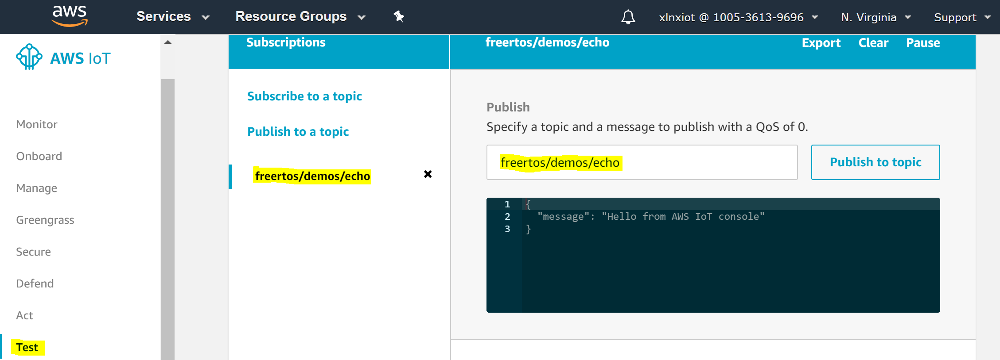
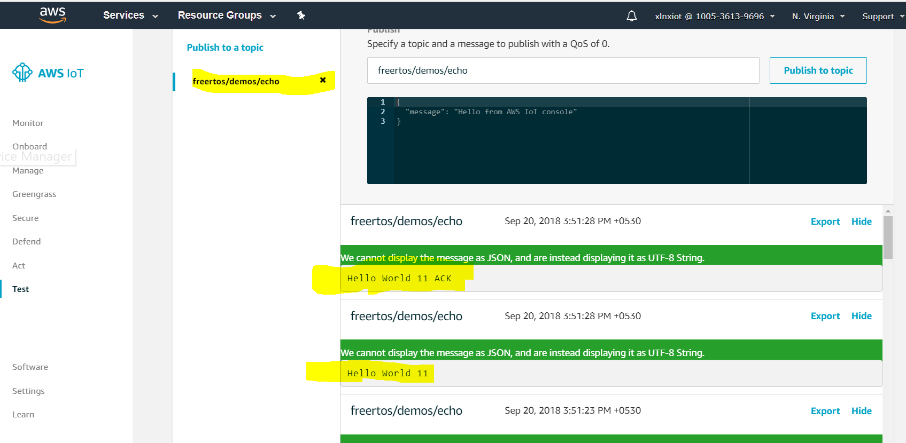

# Lab 2. Establish Amazon FreeRTOS and AWS Greengrass Connectivity

In this lab we will establish basic connectivity to the AWS cloud for both the MicroZed and Ultra96 devices respectively running Amazon FreeRTOS and AWS Greengrass.  In order to do this, we need to establish unique device identities that enable authentication to AWS IoT Core.  This is done through a client certificate and private key.  You will need to create these credentials in your AWS account and then configure them to each device.

## Configure AWS IoT Credentials and Deploy to MicroZed microSD card

In this section, you will configure and deploy AWS IoT Core credentials and copy them to the MicroZed microSD card. The physical credential files, the private key and the certificate for each device will be placed in ```$HOME/aws-cloud-and-xilinx-workshop/edge/auth-PREFIX-node-zynq7k``` and ```$HOME/aws-cloud-and-xilinx-workshop/edge/auth-PREFIX-gateway-ultra96```, where PREFIX is your greengrass group and s3 bucket prefix.

1. Ensure the the MiroZed board is powered off by having both USB cables to J2 and J7 NOT connected to a USB power source.

2. If not already completed remove the microSD card from MicroZed and plug it into the USB microSD card reader on Ultra96:
	1. Eject the MicroZed microSD card.  The microSD card is ejected by gently pressing the card forward toward the slot entry, releasing, and then pulling the card out by hand.
	2. Insert the microSD into a USB-to-SD Card adapter.
	3. Insert the USB-to-SD Card adapter into the USB port of the Ultra96 board. Wait for 5 to 10 seconds.
	
3. On the Ultra96 debug interface navigate to the directory containing the scripts for deploying cloud objects.

   ```bash
   cd $HOME/aws-cloud-and-xilinx-workshop/cloud/script
   ```
   
4. Run the script that configures the credentials for the devices to connect to your AWS account through AWS IoT. The edge hardware that you are using in this workshop is uniquely identified with a group prefix within your AWS account. This allows people at multiple tables who may be sharing a corporate AWS account to operate with their own hardware. Make the prefix match the same value used in the previous lab.

   ```bash
   ./deploy-awsiot-objects.sh <prefix>
   ```

   When the script completes, the keys and certificates will be in the directories specified above. The script will also copy any necessary files directly to the MicroZed microSD card. The required files for the MicroZed platform and written to the microSD card by the script are:
   
   * BOOT.bin
   * PREFIX-node-zynq7k.crt.der	
   * PREFIX-node-zynq7k.key.prv.der
   * ggconfig.txt
   
   BOOT.bin contains the application run on the MicroZed and its associated hardware design.
   The credential files link the device to your account to allow subscription of pre-defined MQTT messages from the platform.
   The file 'ggconfig.txt' contains broker endpoint information and PREFIX for use by the application.

7. Remove the USB-to-SD Card adapter from the Ultra96 USB port.
8. Remove the microSD card from the USB-to-SD adapter.
9. Insert the microSD into the the MicroZed board print side down, with the gold contacts being put in first.  Gently press the card into the slot until it clicks, and then release your finger from the card.

## Configure and Deploy AWS Greengrass on Xilinx Ultra96

The Ultra96 runs Linux and AWS Greengrass. Use the following steps to prepare the credentials for your Ultra96 board,
so that your Ultra96 can be used as a greengrass core.

1. Copy the private key and certificate to AWS Greengrass.

   ```bash
   sudo cp $HOME/aws-cloud-and-xilinx-workshop/edge/auth-*gateway-ultra96/*pem /greengrass/certs/
   ```

2. Copy the AWS Greengrass configuration file ```config.json``` to the AWS Greengrass installation.

   ```bash
   sudo cp $HOME/aws-cloud-and-xilinx-workshop/edge/auth-*gateway-ultra96/config.json /greengrass/config/
   ```

3. With the certificates and configuration file in place,  we can start 
   the AWS Greengrass core service. Run the following commands in the 
   Ultra96 terminal window.

	```bash
	sudo /greengrass/ggc/core/greengrassd start
	```
	Verify that you see the Greengrass daemon start by seeing a response in the CLI of "Greengrass successfully started with PID: XXXX".

4. We will now build a number of AWS Greengrass edge Lambda functions used throughout the workshop.  First build and upload the AWS Lambda function named ```xilinx-hello-world```.

	```bash
	cd $HOME/aws-cloud-and-xilinx-workshop/cloud/script
	./make-and-deploy-lambda.sh xilinx-hello-world
	```

	You can see from its output that the script performs the following acts:

	- Creates a Role for the function if the Role does not already exist
	- Packages the code located in ```$HOME/aws-cloud-and-xilinx-workshop/cloud/xilinx-hello-world``` to a zip file
	- Uploads the code to the AWS Lambda service
	- Applies a version number to the function
	- Creates an alias for the function

5. Although in this lab we are only using one AWS Lambda function, we repeat this step for all the AWS Lambda
   functions to save time for later labs.
   
	```bash
	./make-and-deploy-lambda.sh xilinx-bitstream-deploy-handler
	./make-and-deploy-lambda.sh xilinx-image-upload-handler
	./make-and-deploy-lambda.sh xilinx-video-inference-handler
	./make-and-deploy-lambda.sh aws_xilinx_workshop_core_shadow_proxy_handler
	./make-and-deploy-lambda.sh aws_xilinx_workshop_intelligent_io_error_handler
	./make-and-deploy-lambda.sh aws_xilinx_workshop_telemetry_enrichment_handler
	./make-and-deploy-lambda.sh aws_xilinx_workshop_aws_connectivity_handler
	```

6. Make the initial AWS Greengrass group configuration. The group creation 
   has been automated to reduce the amount of time required for this procedure.

   The prefix used here is the same as the Amazon S3 bucket prefix used in Lab 1.

	```bash
	cd $HOME/aws-cloud-and-xilinx-workshop/edge/script
	./greengrass-core-init.sh <prefix>
	```
	

7. Perform the initial deployment of AWS Greengrass.

	Run these commands in the Ultra96 terminal window.

	```bash
	cd $HOME/aws-cloud-and-xilinx-workshop/cloud/script
	./deploy-greengrass-group.sh <prefix>
	```
   Afer a few seconds, you should be able to see the group has been deployed 
   successfully.

8. Go to the AWS IoT Console page and click on **Test** on the left-hand side menu. 
9. Click on **Subscribe to a topic** under the **Subscriptions** header.
10. In the **Subscription topic** input box, enter ```hello/world```. 
11. Click the **Subscribe to topic** button.
    You should now see a MQTT response from the Ultra96 platform in the test window response.
    See picture below for expected response.

    


## Configure and Deploy Amazon FreeRTOS on Xilinx Zynq-7010

The MicroZed device boots Amazon FreeRTOS from the prepared microSD card and then connects to the AWS Cloud.

1. If you have not already done so, remove the microSD card from the USB adapter and plug the microSD card into the MicroZed board.
2. Power the MicroZed by plugging two USB-to-microUSB cables into J2 and J7.
3. After both power cables are plugged in reset the MicroZed by press the RST/SW2 button on the SoM.
4. If you are not on the page we navigated to in the last section, go to the AWS IoT Console page and click on **Test** on the left-hand navigation menu.
5. Click on **Subscribe to a topic** under the **Subscriptions** header.
6. In the **Subscription topic** input box, enter ```freertos/demos/echo```. 
7. Click the **Subscribe to topic** button.

	
7. In the test window, you should now see an MQTT response from Amazon FreeRTOS running on the MicroZed.  See the picture below for expected response.

	

## Outcomes

In this lab we established basic "hello world" connectivity from an a:FreeRTOS IoT node on the MicroZed platform and from a Linux Greengrass IoT node on the Ultra96 platform.

## Learning More About These Concepts

[Next Lab](./Lab3.md)

[Index](./README.md)
