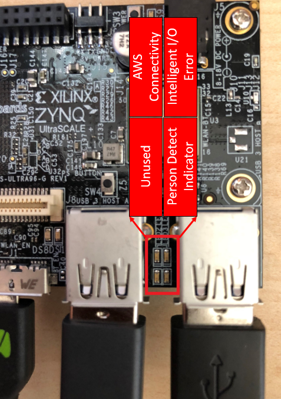
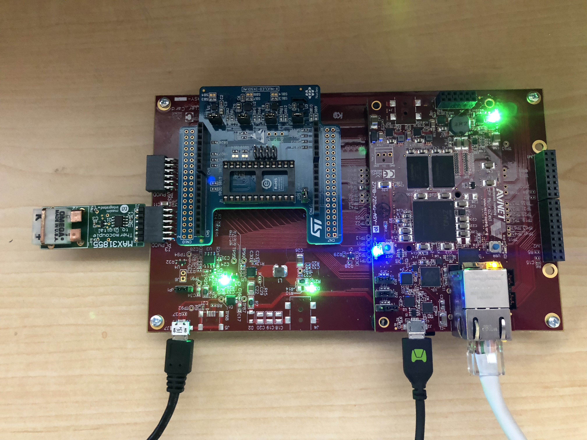

# Lab 3: Create the Distributed Control App

In this lab we will bring sensor data back from the MicroZed Intelligent I/O module to the AWS Cloud to monitor and receive asset owner alerts.

## Deploy a New Greengrass Core Configuration

In the previous lab, you deployed an initial AWS Greengrass configuration. In this lab, you will update the AWS Greengrass configuration. When updating the configuration, the following will happen:

- The Core, Device, and Logging Definitions remain the same.
- The Lambda Definition changes.  The Lambdas used in the last lab will be removed from the Group.
- The Subscription Definition changes. The *hello world* subscriptions will be removed, and a new subscription for propagating telemetry to the cloud from the Zynq-7000 device to the Cloud will be added.

In such case, only two of the six definitions will change, and then the Greengrass Group version will also change.  After modification, we will deploy the new group.

## MicroZed Sensor Data via Greengrass Core

The MicroZed IIoT kit has three sensors availble through the FPGA. The sensors and their interfaces are:

  * Maxim MAX31855 - Thermocouple & IC temperature sensor - SPI
  * ST LPS22HB - Pressure & IC temperature sensor - I2C
  * ST HTS221 - Humidity & IC temperature sensor - I2C

The reference Amazon FreeRTOS image is pre-programmed to poll these interfaces at a fixed rate and send them to AWS Greengrass running on the Ultra96 device.

The Greengrass Core will then route these messages to the AWS Cloud.  The Amazon FreeRTOS on MicroZed will use the Greengrass Discovery capability to identify and configure the Greengrass Core endpoint.  We will then subscribe to the sensor MQTT topics from the AWS IoT Console to verify the data flow to the cloud.

1. If you are not on the page we navigated to in the last section, go to the AWS IoT Console page and click on **Test** on the left-hand side menu.
2. Click on **Subscribe to a topic** under the **Subscriptions** header.
3. In the **Subscription topic** input box, enter ```compressor/+/cooling_system/+```. 
4. Click the **Subscribe to topic** button.

In the IoT Console now you should see data values coming in from the different sensors as shown below.  These are the same values that would be shared with the unit controller in a distributed control application.  The communication route between MicroZed and AWS Greengrass Core on Ultra96 were configured as part of the edge configuration script in Lab 1.


## MicroZed Sensor Failure

The application built on Amazon FreeRTOS running on the MicroZed implements checks on the sensor to identify error conditions. It alerts the control system such that it can protect itself and the asset under control.

In this section, we will simulate a sensor failure by pulling the thermocouple from the MAX31855 board while the system is running.  Disconnecting the thermocouple creates an **open-circuit condition** detected by the FPGA platform and generates a sensor health message to the unit controller and AWS Cloud.

> In this implementation, the cooling system module represented by the UltraZed modifies the AWS Greengrass Core Shadow directly to alert than an issue has taken place.   The lab uses a simplified implementation model to achieve the actuation outcome.  In a more practical implementation, the cooling system module would modify its own Shadow's **reported state**, where an AWS Lambda function in AWS Greengrass would read the change.  It would then determine if any further action needs to take place -- for example, triggering the LED on the compressor's Intelligent I/O Module via the Intelligent I/O Module's shadow.

1. In AWS IoT Console go to the **Manage** menu on the left pane.
2. Click **Things**, which is the first item under **Manage**.
3. Locate the Thing that represents your core. The name is ```<prefix>-gateway-ultra96```.
4. Click on **Shadow**.
5. In the IoT Console now you should see a non-error state message for the thermocouple.
3. Observe the Ultra96 board (unit controller in our control application) now and you will see that the Intelligent I/O module error LED is **NOT** lit (User LED #1).  See the LED defintions in the picture below.

   

4. Now unplug the thermocouple (NOT the entire board) from the MAX31855.  See picture below for reference.

   
   
5. Now observe the Ultra96 board and you will see that the Intelligent I/O module error LED is lit (User LED #1).

   > **What happened?** The application detected the **open circuit condition** and updated the AWS Greengrass Core's Device Shadow directly - setting the **Desired State** of the LED.  After the AWS Greengrass Core turns on the LED successfully, it updates its own Device Shadow with the **Reported State**.  But how are we seeing this in the AWS IoT Core Console?  AWS Greengrass is automatically synchronizing the Device Shadow between the edge and the cloud.

   This cloud data point could be used to trigger other automated notifications (e.g. email, text) to the asset owner and field engineer.

7. Plug the thermocouple module back in and you should see the Intelligent I/O module error LED shutoff and the health bit in the Device Shadow clear.

## Outcomes

In this lab, you brought in live control sensor readings into the AWS cloud and saw them plotted on a dashboard using the MQTT communication mechamisms of a:FreeRTOS.  We then invoked a sensor health failure which caused the MicroZed device shadow to change to a failed state; which was automatically detected by the unit controller and AWS cloud to generate alerts.

## Learning More About These Concepts

[Next Lab](./Lab4.md)

[Index](./README.md)

