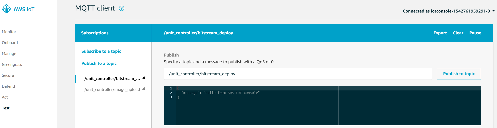
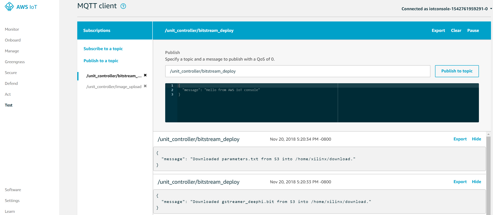

# Lab 4: Deploy ML in the edge

In this lab we will deploy an FPGA based machine learning (ML) video 
surveillance application to the remote asset unit controller (Ultra96).
Amazon IoT console will serve as the system deployment dashboard; we will
 incrementally add and test functions for the running system.

## Preparation

In lab 2, we already deployed the lambda functions in your Greengrass group. 
So in this lab we will just reuse the same group you deployed before.
As a summary,

1. Your group name was defined to be `<your-group-prefix>-gateway-ultra96-group`.
2. Your S3 bucket name was defined to be `<your-unique-prefix>-aws-cloud-and-xilinx-workshop`.

There are a few things to make sure:

1. Your greengrass core service needs to be running. To check that:

   ```shell
   ps aux | grep /greengrass/gg/packages/1.7.0/bin/daemon
   ```
   You should be able to see a running process in the background. 

2. Keep in mind that this lab will only succeed if you have a successful 
   deployment in lab 2. 

3. Our lambda functions have a life time of 500 seconds. So if you have waited
   too long before doing this lab, run the following command to redeploy 
   the Greengrass group.
   
   ```shell
   cd $HOME/aws-cloud-and-xilinx-workshop/cloud/script
   ./deploy-greengrass-group.sh <your-group-prefix>
   ```

## Lab Steps
In lab 2 we tested our AWS Greengrass group on the topic "hello/world"; in this
lab we will try the other topics: 

* "/unit_controller/bistream_deploy": subscribed lambda function will download 
bitstream from your S3 bucket.
* "/unit_controller/image_upload": subscribed lambda function will upload 
captured pictures with detected people onto the S3 bucket.

Now lets get started with a successfully deployed AWS Greengrass group:
1. Connect the eCon USB camera to the Ultra96 board J8.  See the picture below 
showing Ultra96 with the camera connected.

   

2. Go to `/home/xilinx/download`; this folder is empty before we do anything.

3. Go to the AWS IoT Console page and click on "Test". Click on 
"Subscribe to a topic" and enter "/unit_controller/bitstream_deploy". Click on
"Subscribe to topic" to confirm. Repeat this for the topic 
"/unit_controller/image_upload".
See picture below for expected result.

   

4. Now click on the topic /unit_controller/bitstream_deploy. Click on 
"Publish to topic" to trigger the lambda function. After a few seconds, you 
should be able to see the following result:

   

   After this call, your `/home/xilinx/download` is no longer empty.
   This indicates the Ultra96 has received the ML configuration files 
   (`*.bit` and `*.txt`) from the AWS cloud. 
   You can publish on this topic again, and you will get similar response 
   each time.

5. On the Ultra96 debug interface navigate to the directory that is 
synchronized with your S3 bucket.

   ```shell
   cd <your-unique-prefix>-aws-cloud-and-xilinx-workshop
   ```

6. Run the ML video surveillance application.

   ```shell
   sudo /usr/local/bin/pydeephi_yolo.py <num_seconds> <threshold>
   ```

   In the above command, we are running a person-detect algorithm which outputs 
the captured video frame (saved as `*.jpg`) along with the number of people 
detected in that frame (stored in `*.txt`). The argument 'num_seconds' 
specifies how long this application is going to run. The argument 
'threshold' specifies the capture condition; that is, the video frame is 
capture only if there are a number of persons no less than the threshold value.

   You can start with 'num_seconds' = 5 and 'threshold'= 2.

7. Point the camera at a few persons; you should see the 
"Person Detect Indicator" LED lit when a number of 
persons are in view of the camera. 

   

   Point the camera at a location where there are no persons; you should see that
LED turn off.

8. If there are people detected, you will see a number of files generated in 
your current directory. These files are uploaded onto the S3 bucket, so
you will also see some messages on the topic "/unit_controller/image_upload".

   

9. Go to your S3 bucket on AWS cloud; you will see there is a new folder 
`images` created. Check the images stored in that folder.


## Outcomes
In this lab we used AWS Greengrass to deploy an ML video 
surveillance application to a running control system in the Ultra96 platform. 

## Learning More About These Concepts

[Next Lab](./Lab5.md)

[Index](./README.md)

