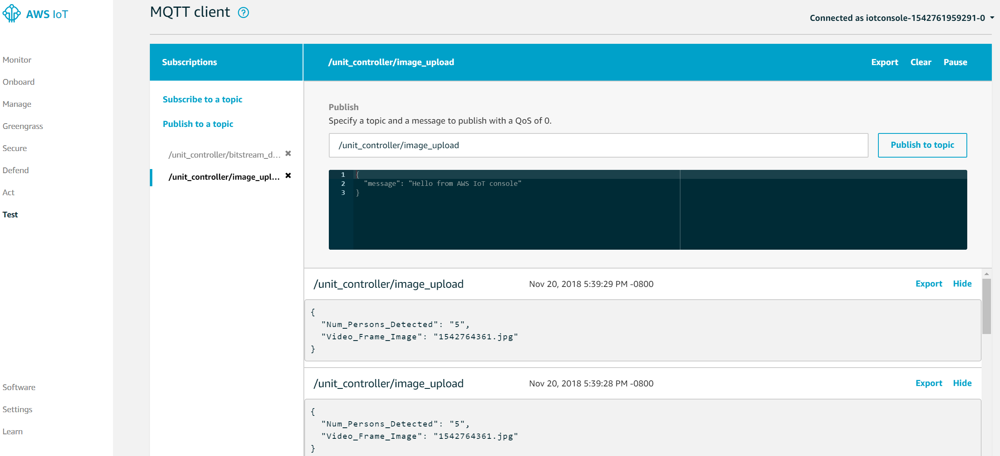

# Lab 4: Deriving Machine Learning Inference Value

In Lab 2, we tested our AWS Greengrass Core on the topic "hello/world". In this lab, we will work more with the AWS Greengrass Core's Device Shadow and other topics.

In this lab, you will make use of the Video Inference Handler and Image Upload Handler functions we deployed in Lab 2 to to send a Machine Learning based "person activity" alert from the remote asset unit controller USB camera to the AWS Cloud along with a still frame video capture of the image.

* ```compressor/<groupname>```: The AWS Lambda function responsible for uploading video frame images with inferred 'boxes' around persons sends telemetry to this topic. The message payload composes the number of persons found and the image file name.

Our ML video surveillance application uses two parameters:

* 'num_seconds': specifies how long this application runs.
* 'threshold': specifies the capture condition. The video frame is captured when there are a number of persons no less than the threshold value.

## Preparation

In lab 2, we deployed the lambda functions configured as part of your Greengrass group.  In this lab we will reuse the same group.
As a summary,

1. Your group name was defined to be ```<prefix>-gateway-ultra96-group```.
2. Your S3 bucket name was defined to be ```<prefix>-aws-cloud-and-xilinx-workshop```.

Make sure your greengrass core service are still running. To check that:

```shell
ps aux | grep /greengrass/gg/packages/1.7.0/bin/daemon
```

You should be able to see a running process in the background.

## Lab Steps

Now lets get started with the existing AWS Greengrass group.

1. If you have not done so, connect the eCon USB camera to the Ultra96 board J8. 
   See the picture below showing Ultra96 with the camera connected.

   

2. In the terminal window connected to the Ultra96, issue the folowing command:
   
   ```bash
   cd $HOME/download
   ```
   Verify that this folder is empty before we do anything.

3. Now let's redeploy the AWS Greengass group.

   ```bash
   cd $HOME/aws-cloud-and-xilinx-workshop/cloud/script
   ./deploy-greengrass-group.sh <prefix>
   ```

   After a few seconds your group should be successfully deployed.

   > When a person is detected at the edge device it will also trigger a capture of the video frame, add bounding boxes to identify the persons within the video frame captured, and transmit the frame to AWS Cloud.

4. Go to the AWS IoT Console page and click on **Test** on the left-hand side menu. 
5. Click on **Subscribe to a topic** under the **Subscriptions** header.
6. In the **Subscription topic** input box, enter ```compressor/+```. 
7. Click the **Subscribe to topic** button.

   See picture below for expected result.

   

   > Notice that your have a long-running lambda function calling the video inference. 
   You will see some messages published on the topic ```compressor/+``` 
   when you are pointing the camera to a few persons.

   Since you have not provided any ML configurations, the video surveillance application will use the default parameters ('num_seconds' = 5, 'threshold' = 2).

# Outcomes
In this lab you saw the ability to bring data back from an FPGA based machine learning application deployed at the edge.  Deploying ML inference at the edge offers the ability to dramatically reduce the volume of data required to be sent back to the cloud which is important for remote industrial assets where connectivity is intermittent, expensive, and bandwidth limited.

## Learning More About These Concepts

[Next Lab](./Lab5.md)

[Index](./README.md)

