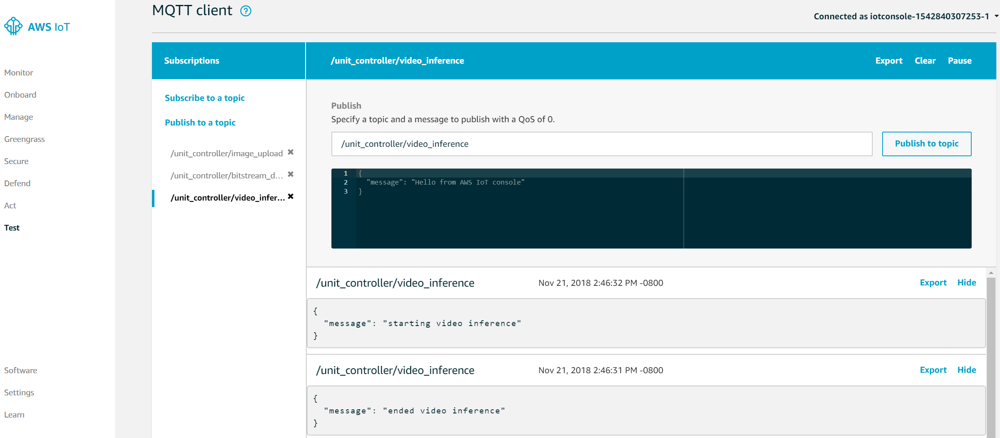

# Lab 5: Deploy ML in the edge

In this lab we will experience FPGA based machine learning (ML) video 
surveillance application to the remote asset unit controller for the **Compressor** physically represented by the Ultra96 development board.
The AWS IoT console will serves as the system deployment dashboard; we will incrementally add and test functions for the running system.

## Preparation

In lab 2, we deployed the lambda functions configured as part of your Greengrass group.  In this lab we will reuse the same group.
As a summary,

1. Your group name was defined to be ```<prefix>-gateway-ultra96-group```.
2. Your S3 bucket name was defined to be ```<prefix>-aws-cloud-and-xilinx-workshop```.

Make sure your greengrass core service are still running. To check that:

```shell
ps aux | grep /greengrass/gg/packages/1.7.0/bin/daemon
```

You should be able to see a running process in the background.

## Lab Steps

In Lab 2, we tested our AWS Greengrass Core on the topic "hello/world". In this lab, we will work more with the AWS Greengrass Core's Device Shadow and other topics:

* ```compressor/<groupname>```: The AWS Lambda function responsible for uploading video frame images with inferred 'boxes' around persons sends telemetry to this topic. The message payload composes the number of persons found and the image file name.

Our ML video surveillance application uses two parameters:

* 'num_seconds': specifies how long this application runs.
* 'threshold': specifies the capture condition. The video frame is captured when there are a number of persons no less than the threshold value.

Now lets get started with the existing AWS Greengrass group:

1. Connect the eCon USB camera to the Ultra96 board J8.  See the picture below showing Ultra96 with the camera connected.

   

2. In the terminal window connected to the Ultra96, issue the folowing command:
   
   ```bash
   cd /home/xilinx/download
   ```
   Verify that this folder is empty before we do anything.

3. Now lets redeploy the AWS Greengass group.

   ```bash
   cd $HOME/aws-cloud-and-xilinx-workshop/cloud/script
   ./deploy-greengrass-group.sh <prefix>
   ```

   After a few seconds your group should be successfully deployed.
   
4. Go to the AWS IoT Console page and click on **Test** on the left-hand side menu. 
5. Click on **Subscribe to a topic** under the **Subscriptions** header.
6. In the **Subscription topic** input box, enter ```compressor/+```. 
7. Click the **Subscribe to topic** button.

    **TODO** NEED TO CHANGE See picture below for expected result.

   

   > Notice that your have a long-running lambda function already publishing on the topic ```compressor/+```, indicating the video inference is being called. 

   Since you have not provided any ML configurations, the video surveillance application will use the default parameters ('num_seconds' = 5, 'threshold' = 2).

8. In AWS IoT Console go to the **Manage** menu on the left pane.
9. Click **Things**, which is the first item under **Manage**.
10. Locate the Thing that represents your core. The name is ```<prefix>-gateway-ultra96```.
11. Click on **Shadow**.
12. Click on the **Edit** link.
13. Change the Device Shadow JSON document until it aligns with the following block where the desired state for ```bitstream_version``` is ```2```.  Note, based on what has happened in previous labs, the Device  Shadow might look slightly different.  The key is setting the desired state of the ```bitstream_version```.

	```json
   	{
     		"desired": {
       		"bitstream_version": 2
     		}
   	}
	```

14. Click **Save**.

	For a moment, you will see a ```delta``` section.  And then it will disappear.  Also the ```reported``` section for the value displays ```2```.
	
    > **What just happened?**  When changing the desired state, the event triggered the AWS Lambda function in AWS Greengrass to download version 2.  When it completed, the AWS Lambda function reported back that it completed downloading version 2.

15. After this call, your `/home/xilinx/download` is no longer empty.
   This indicates the Ultra96 has received the ML configuration files 
   ('.bit' and '.txt') from the AWS cloud. 
   You can publish on this topic again, and you will get similar response each time.
   
16. In the file `parameters.txt`, the first value is the parameter 
   'num_seconds', and the second value is the parameter 'threshold'. The threshold should now be '3', demonstrating a parameterized change in behavior.

   > **Wait, what about the bitstream?** Sure! If you have a newly developed bitstream, you can deliver it in the same way.

17. point the camera to a framed area of three persons or more.  Note that inference messages are sent 
"/unit_controller/video_inference", point the camera at a few persons; 
you should see the "Person Detect Indicator" LED lit when a number of 
persons are in view of the camera. 

   

   Point the camera at a location where there are no persons; you should see 
that LED turn off.

18. If there are people detected, you will see a number of files generated in 
`<prefix>-aws-cloud-and-xilinx-workshop`. 
These files will be uploaded onto the S3 bucket, so
you will also see some messages on the topic "/unit_controller/image_upload".

   

8. On the Ultra96 debug interface navigate to the directory that is 
synchronized with your S3 bucket.

   ```bash
   cd <prefix>-aws-cloud-and-xilinx-workshop
   ```

   You will see several new files generated. The ```<epoch-time>.png``` files are the captured frames; the ```<epoch-time>.txt``` files store the number of people captured in that frame.

9. Go to your S3 bucket on AWS cloud; you will see there is a new folder `images` created. Check the images stored in that folder.


## Outcomes
In this lab we used AWS Greengrass to deploy an ML video 
surveillance application to a running control system in the Ultra96 platform. 


# Learning More About These Concepts


[Index](./README.md)

